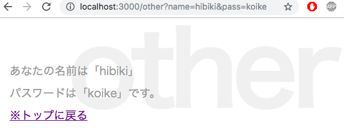

## Node.js 超入門
### 小池響
### 範囲:p195~p242


---

## OUTLINE

- ### 4-1 Expressを利用しよう
- ### 4-2 Expressの基本をマスターする
- ### 4-3 Express Generatorを使おう

---

## 4-1 Expressを利用しよう

+++

### package.jsonについて
- 「npm init」の実行時に作成される
- npmで使用するパッケージ情報が記述されている
- JavaScriptのJSON形式のテキスト
　
+++?code=4-02.json

### パッケージ情報のオブジェクトを記述している


+++

- name: パッケージの名前
- version: バージョン番号
- description: 説明文
- main: メインプログラムのファイル名
- scripts: 実行するスクリプトの設定
- author: 作者名
- license: ライセンスの形式
- dependencies: 使用しているパッケージの情報

---

## 4-2 Expressの基本をマスターする

+++

### EJSの導入

テンプレートエンジンの導入を行う
コマンドは「npm install --save ejs」
+++?code=4-03.json
package.json
@[11,12,13,14](dependenciesの項目の値にejsの値が追加されている)

+++

テンプレートのソースコードを記述する

+++?code=4-04.ejs
index.ejs
@[15](<%- %>タグでエスケープ処理をせずにそのまま出力)

+++

### テンプレートファイルを読み込んで表示する

+++?code=4-05.js
index.js
@[2](EJSモジュールをロード)

@[6](レンダリングエンジンの設定、ejsオブジェクトの「renderFile」メソッドを用いてレンダリングする)

@[8](GETのアクセス処理)

+++
## エンジンの設定
- app.engineでレンダリングエンジンの設定を行う
    - 第一引数でレンダリングするファイルの拡張子、第二引数で関数/メソッドを指定する
+++


+++

### 公開フォルダのファイルを使う

+++?code=4-07.js
index.js
@[8](アプリケーションに処理を追加している)

+++

## express.staticとは

+++

expressオブジェクトの中のstaticというメソッドを表している。

引数に指定したファイルを静的なファイルとして利用できるようにするもの。

静的なファイルとは、プログラムを書かれているまま使うファイルのことである。

static('public')とするとpublicフォルダ内のファイルが使えるようになる。

+++?code=4-09.js
index.js

@[9,21](これによって２つのページを表示できるようにした)

+++

Expressではapp.getを使用することでNode.jsと比べて、
ページの追加が非常に簡単になったことがわかる。

+++

### クエリーパラメーターの利用

+++?code=4-10.js
index.js

@[23,24](queryにキーを指定すればその値を取り出すことができる。))

+++


+++


+++
クエリーの値を変更してみる


+++

## Body Parser

+++

### フォームを扱うためのモジュール
導入するコマンドは「npm install --save body-parser」

+++?code=4-11.ejs
index.ejs
@[16,17,18,19](入力フィールドを持ったフォームを用意した。)

+++?code=4-12.js
index.js
@[8](Body Parserのロードを行う。)
@[9](urlencodedを設定。詳細は後述)
@[24,25](req.body.messageが送られた値であり, BodyParserによってbodyにまとめられる)

+++

urlencodedの設定

```js
app.use(bodyParser.urlencoded({extended: false}));
```
- urlencodedはURLエンコードされたボディを返す働きをする
    - 送信された内容が変換されて取り出される
- 引数の値はquerystringを利用してエンコードすることを指定する
    - これはフォームを利用するとき必ず書くものと覚えていれば良い
+++


フォームにメッセージと書いて送信
+++

送信結果
+++

### テーブル表示

+++?code=4-14.ejs
index.ejs

+++
```css
table {
    margin: 20px;
}
table tr th {
    background-color: #999;
    color: #fff;
    text-align: center;
    padding: 3px 10px;
}
table tr td {
    background-color: #eee;
    color: #666;
    text-align: left;
    padding: 3px 10px;
}
```
style.css
テーブル関連のスタイルを追加しておく。

+++?code=4-16.js
index.js
@[11,12,13,14,15,16](データを追加する。dataをdataとして渡している。))

+++
Expressではfilenameの指定が不要である。

テンプレート側でincludeすればパーシャルを利用できる。

+++

+++

### まとめ
## Expressの特徴
- Node.jsの機能をより簡単に！｜
- テンプレートエンジンの設定に使用するメソッドは？
    -app.engine|
- express.staticの引数はどのようなファイルとして利用できるか？
    -静的、書かれているまま使うことができる|
- GETアクセスを追加するメソッドは？
    -app.get|
- クエリーパラメーターを保管するプロパティは？
    -req.query|
- フォームを処理するモジュールは？
    -Body Parser|
- テーブル利用時に不要なものは？
    -filename|


---
## 4-3 Express Generator

+++
## Expressの不満点は？
- 手書きであること
- ソースコードの整理が必要
- 必要なモジュールをインストールしなければならない
Express Generatorが解決してくれる!!!|

+++

## Express Generatorの利点
- アプリの基本部分を自動生成する
- 必要なモジュールが揃っている
- ページごとに独立したスクリプトファイルでプログラムを書く。

+++

## まずはインストール
コマンドは「npm install -g express-generator

+++

## アプリの作成
コマンド「express -e フォルダ名」
これだけでアプリが作成できる

※ -e というオプションはテンプレートエンジンにEJSを指定している

+++

## パッケージのインストール
この時点では必要なパッケージ類がないのでコマンド「npm install」を実行

これによってpackage.jsonを読み込む

+++

## アプリケーションの実行


コマンド「bin/www」「npm start」だけでアプリケーションが起動する

+++


+++
## アプリケーションのファイル構成
作成されたフォルダの中身は
- bin
- public
- routes
- views
- node_modules
- app.js
- package.json, package-lock.json
+++?code=4-17.js
app.js
## プログラムの流れの整理

@[1,2,3,4,5] (必要なモジュールのロード)
@[7,8](ルート用スクリプトのロード)
@[10,12,13,14](Expressオブジェクトの作成と基本設定)
@[16,17,18,19,20,21,22,23](app.useによる関数組み込み)
@[25,26,27,28,29,30,31,32,33,34,35,36,37,38,39](アクセスするルートとエラー用のapp.use作成)
@[41](module.exportsの設定)

+++
## モジュールのロード
- http-errors: Expressのエラーに関するもの
- express: Express本体
- path: ファイルパスを扱うモジュール
- morgan: HTTPリクエストのログ出力に関するモジュール

+++
## ルート用スクリプトのロード
Express Generatorではアプリで利用するアドレスごとに、そのアドレスにアクセスした際に実行するスクリプトをファイルとして用意するようになっているので、割り当てるアドレスごとに呼び出されるように設定しておく。

これらのスクリプトファイルはapp.js内にロードして使われることになるので、

「routes」内のスクリプトファイルは1つのスクリプトファイルに書かれたのと同じように働くようになる!!
+++

## Expressオブジェクトの作成と基本設定
app.setは必要とする各種設定をセットするもの。

これでテンプレート関係の設定を行なっている

+++
## app.useによる関数組み込み
アプリケーションに必要な処理の組み込みを行う。

requireでロードしたモジュールの機能を呼び出すようにしている。
+++
## アクセスのためのapp.use作成
特定のアドレスにアクセスした時の処理の設定。

第一引数に割り当てるパスを指定し、関数を設定すれば、そのアドレスにアクセスした際その関数が実行される
+++
## module.exportsの設定
moduleオブジェクトの「exports」というプロパティにappオブジェクトを設定する。

これによって設定したオブジェクトが外部からアクセスできるようになる。

+++
## wwwコマンドとは
プログラムを実行するためのコマンドのような役割を持つ
モジュールをロード、ポート番号の値を設定、サーバーの実行など、、、

+++
## 役割をまとめると
- www: プログラムを実行する(基本編集することはない)
- app.js: アプリケーション本体の設定
- routes内のスクリプト: 特定のアドレスにアクセスした時の処理

+++

## Webページを追加してみる
テンプレート、ルーティング用スクリプト、を作ってみよう
+++?code=4-21.ejs
hello.ejs
### テンプレートの作成

+++?code=4-22.js
index.js
### ルーティング用スクリプトの作成

+++

## app.jsの修正
ここでスクリプトのロードとアドレスへの割り当てを追記しなければならない

``` javascript
var hello= require('./routes/hello');

app.use('/hello',hello);
```
実行してみると、、、
+++


+++
## app.useとrouter.getの役割
router.getの第一引数は'/'としてあるがapp.jsで「app.use('/hello',hello);」と記述したため

'/hello'のアクセスされればhelloが呼び出されるようになっている|

router.get('/',.....)の役割は/hello/にアクセスした際の処理を表す

+++

### まとめ

- Expressの基本手順は
    - expressオブジェクトの用意、appオブジェクトの作成、ルートの設定、待ち受け開始|
- wwwコマンドはどのようなものか
    - プログラムの実行|
- app.jsはどのようなものか
    - アプリケーション本体の設定|
- routes内のスクリプトはどのようなものか
    - 特定のアドレスにアクセスした時の処理
