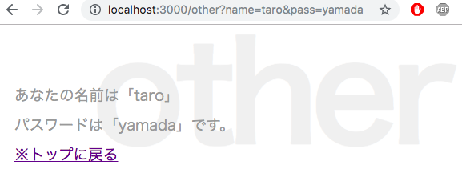

## Node.js 超入門
### 小池響
### 範囲:p195~p242


---

## OUTLINE

- ### 4-1 Expressを利用しよう
- ### 4-2 Expressの基本をマスターする
- ### 4-3 Express Generatorを使おう

---

# 4-1 Expressを利用しよう

+++

### package.jsonについて
- 「npm init」の実行時に作成される
- npmで使用するパッケージ情報が記述されている
- JavaScriptのJSON形式のテキスト
　
+++?code=4-2.json

### パッケージ情報のオブジェクトを記述している


+++

- name: パッケージの名前
- version: バージョン番号
- description: 説明文
- main: メインプログラムのファイル名
- scripts: 実行するスクリプトの設定
- author: 作者名
- license: ライセンスの形式
- dependencies: 使用しているパッケージの情報

---

# 4-2 Expressの基本をマスターする

+++

### EJSの導入

テンプレートエンジンの導入を行う
コマンドは「npm install --save ejs」
+++?code=4-03.js

@[11,12,13,14](dependenciesの項目の値にejsの値が追加されている)

+++

テンプレートのソースコードを記述する

+++?code=4-04.ejs
@[15](<%- %>タグでエスケープ処理をせずにそのまま出力)

+++

### テンプレートファイルを読み込んで表示する

+++?code=4-05.js
@[2](EJSモジュールをロード)

@[6](レンダリングエンジンの設定、ejsオブジェクトの「renderFile」メソッドを用いてレンダリングする)

@[8](GETのアクセス処理)

+++
##　エンジンの設定
- app.engineでレンダリングエンジンの設定を行う
    - 第一引数でレンダリングするファイルの拡張子、第二引数で関数/メソッドを指定する
+++


+++

###　公開フォルダのファイルを使う

+++?code=4-07.js
@[8](アプリケーションに処理を追加している)

+++

## express.staticとは

+++

expressオブジェクトの中のstaticというメソッドを表している。
引数に指定したファイルを静的なファイルとして利用できるようにするもの。
静的なファイルとは、プログラムを書かれているまま使うファイルのことである。
static('public')とするとpublicフォルダ内のファイルが使えるようになる。

+++?code=4-09.js

@[9,21](これによって２つのページを表示できるようにした)

+++

Expressではapp.getを使用することでNode.jsと比べて、
ページの追加が非常に簡単になったことがわかる。

+++

###　クエリーパラメーターの利用

+++?code=4-10.js

@[23,24](queryにキーを指定すればその値を取り出すことができる。))

+++


+++



+++
クエリーの値を変更してみる


+++

# Body Parser

+++

## フォームを扱うためのモジュール
導入するコマンドは「npm install --save body-parser」

+++?code=4-11.ejs
@[16,17,18,19](入力フィールドを持ったフォームを用意した。)

+++?code=4-12.js
@[8](Body Parserのロードを行う。)
@[9](urlencodedを設定。詳細は後述)
@[24,25](req.body.messageが送られた値であり, BodyParserによってbodyにまとめられる)

+++

urlencodedの設定

```js
app.use(bodyParser.urlencoded({extended: false}));
```
- urlencodedはURLエンコードされたボディを返す働きをする
    - 送信された内容が変換されて取り出される
- 引数の値はquerystringを利用してエンコードすることを指定する
    -これはフォームを利用するとき必ず書くものと覚えていれば良い
+++


フォームにメッセージと書いて送信
+++

送信結果
+++

### テーブル表示

+++?code=4-14.ejs
@[17,18,19](変数dataから順に値を取り出すようにしている。そしてkeyとdata[key]の値をパーシャル側へ渡す。)

+++?4-15.css

テーブル関連のスタイルを追加しておく。

+++?4-16.js

@[11,12,13,14,15,16](データを追加する。dataをdataとして渡している。))
Expressではfilenameの指定が不要である。

+++

+++

## まとめ
# Expressの特徴
- Node.jsの機能をより簡単に！｜
- テンプレートエンジンの設定に使用するメソッドは？
    -app.engine|
- express.staticの引数はどのようなファイルとして利用できるか？
    -静的、書かれているまま使うことができる|
- GETアクセスを追加するメソッドは？
    -app.get
- クエリーパラメーターを保管するプロパティは？
    -req.query
- フォームを処理するモジュールは？
    -Body Parser
- テーブル利用時に不要なものは？
    -filename


---
# 4-3 Express Generator

+++
## Expressの不満点は？
- 手書きであること
- ソースコードの整理が必要
- 必要なモジュールをインストールしなければならない|
## それをExpress Generatorが解決してくれる

+++

##　Express Generatorの利点
- アプリの基本部分を自動生成する
- 必要なモジュールが揃っている
- ページごとに独立したスクリプトファイルでプログラムを書く。

+++

## まずはインストール
コマンドは「npm install -g express-generator

+++

## アプリの作成
コマンド「express -e フォルダ名」
これだけでアプリが作成できる

※ -e というオプションはテンプレートエンジンにEJSを指定している

+++

## パッケージのインストール
この時点では必要なパッケージ類がないのでコマンド「npm install」を実行

これによってpackage.jsonを読み込む

+++

## アプリケーションの実行


コマンド「bin/www」「npm start」だけでアプリケーションが起動する

+++


+++
##　アプリケーションのファイル構成
作成されたフォルダの中身は
- bin
- public
- routes
- views
- node_modules
- app.js
- package.json, package-lock.json
+++?=code4-17.js
##　プログラムの流れの整理

@[1,2,3,4,5] (必要なモジュールのロード)
@[7,8](ルート用スクリプトのロード)
@[10,12,13,14](Expressオブジェクトの作成と基本設定)
@[16,17,18,19,20,21,22,23](app.useによる関数組み込み)
@[25,26,27,28,29,30,31,32,33,34,35,36,37,38,39](アクセスするルートとエラー用のapp.use作成)
@[41](module.exportsの設定)

+++
## モジュールのロード
- http-errors: Expressのエラーに関するもの
- express: Express本体
- path: ファイルパスを扱うモジュール
- morgan: HTTPリクエストのログ出力に関するモジュール

+++
##　ルート用スクリプトのロード
Express Generatorではアプリで利用するアドレスごとに、そのアドレスにアクセスした際に実行するスクリプトをファイルとして用意するようになっているので、割り当てるアドレスごとに呼び出されるように設定しておく。

これらのスクリプトファイルはapp.js内にロードして使われることになるので、

「routes」内のスクリプトファイルは1つのスクリプトファイルに書かれたのと同じように働くようになる!!
+++

## Expressオブジェクトの作成と基本設定
app.setは必要とする各種設定をセットするもの。

これでテンプレート関係の設定を行なっている

+++
## app.useによる関数組み込み
アプリケーションに必要な処理の組み込みを行う。

requireでロードしたモジュールの機能を呼び出すようにしている。
+++
## アクセスのためのapp.use作成
特定のアドレスにアクセスした時の処理の設定。

第一引数に割り当てるパスを指定し、関数を設定すれば、そのアドレスにアクセスした際その関数が実行される
+++
## module.exportsの設定
moduleオブジェクトの「exports」というプロパティにappオブジェクトを設定する。

これによって設定したオブジェクトが外部からアクセスできるようになる。

+++
## wwwコマンドとは
プログラムを実行するためのコマンドのような役割を持つ
モジュールをロード、ポート番号の値を設定、

+++

``` javascript
var hoge0;

hoge1 = 1;

let hoge2;

const hoge3;
```
- 代入するなら 変数 = 値 |
- 変数の値取得は 代入先 = 変数名 |

+++

### 計算をする
- 加算: +
- 減算: -
- 乗算: *
- 除算: /

+++ ?code=a3.html

+++ ?code=a3.js

+++


+++

### まとめ

- JavaScriptはhtml上で動作するスクリプト言語
- htmlに直書きするか、jsファイルを作成してhtmlで読み込む |
- 値を保存し、管理する"変数"
- 主要なデータ型3つは、number, string, boolean |
- 変数計算をして、その値をhtml上に出力することができる

---

## 2-1 ソースコードの基本

+++

#### 第一回にて実行したソースを分解してみる

``` js
require('http').createServer(
    (rq,rs)=>{rs.end('Hello Node.js!');}).listen(3000);
```

+++?code=2-01.js

#### こんなかんじにできる

+++

### Nodeで実行してみる

``` shell
$ node app.js
```

+++

#### localhost3000番にアクセス


+++

### :3000って?

- ポート番号と言い、サーバへアクセスする上、同一サーバ上でサービスの選択をする事ができる |

### どうして3000番なの?

- nodeでは標準的に3000番を利用するようになっている |

+++?code=2-01.js

@[1](httpモジュールを取得して代入)
@[3](サーバオブジェクトの生成)
@[4,5,6](クライアントからアクセスされたときの動作を無名関数で定義)
@[8](ポート番号3000番によるアクセスを待機)

+++

### アクセスに対してhtmlを返すことを考える

いままではただのテキストだったのを、HTMLの出力にしたい

+++?code=2-02.js

+++


+++

### そもそも...
- HTTP通信でサーバからhtmlを取得している |
- HTTP通信をする上で、現状だと不足してるものが... |
- ヒント: 先程つくったhtml部はレスポンスボディ部になる

+++

### ヘッダをつける必要がある!!

+++?code=2-03.js

@[5](ヘッダを設定する)
@[5](送信するコンテンツはhtmlであることを定義)

+++


+++?code=2-03.js
### ヘッダ情報の他に追加したもの

@[6](使用している言語が日本語で有ることを定義)
@[7](使用する文字コードがUTF-8であることを定義)

+++

### console.logについて

- console.logはいわゆる標準出力でクライアントには最初は見えない |
- デバッグなどで動作確認するために利用しよう |

+++ 

### まとめ

- nodeでサーバオブジェクトを作るときに実行する文は
    - require('http'); |
- サーバを、クライアントからの3030番アクセス待ちにする為の関数は
    -  server.listen(3030); |
- レスポンスを返す際にHTML出力をしたい場合、response.endの他の手段は
    - response.write |

--- 

## 2-2 HTMLファイルを使おう 

+++

### さっきまでは

- jsソース内に書いてあったHTMLを返していた
- js内で書くのってめんどう...
- htmlを別ファイルで読み込めるようにしよう |

+++?code=2-04.html

### 今回のhtmlソース


+++?code=2-05.js

### 別ファイルを読み込んでそれを返すプログラム

@[2](ファイルを扱うFileSystemオブジェクトの作成)
@[6](読み込みたいファイルと文字コードを指定)
@[9](dataの中に読み込んだ情報が入っている)


+++ 

### 今度は...
#### 関数に分解したい

- 整理しやすい |
- 再利用性があがるetc... |

+++?code=2-06.js

@[4](後述のgetFromClient関数でレスポンス処理を分解している)
@[11,12,13,14,15,16,17,18,19,20,21](切り離して記述した処理)
@[12](関数の定義は funtion でおこなう)

+++?code=2-07.js
コールバック関数単位で分解してみる

@[3,4](分解した際に渡せなくなる値用に宣言)
@[13,14,15,16,17,18](createServerのコールバック関数部)
@[22,23,24,25,26](readfileのコールバック関数部)

+++

### 非同期処理について

#### ざっくり
- 順番に処理をしていく: 同期処理 |
- とにかく命令を優先(処理の進捗は二の次) 非同期処理 |

- keyword: async, await

+++

### jsでできる他のこと
#### テキストの操作 |

+++?code=2-08.html

### ちょっと修正

+++?code=2-09.js

@[17,18,19](読み込んだdata, htmlファイルから、対応する文字列を置換する)
@[18,19](/ hoge /g は、正規表現)


+++ 

### まとめ
- ファイルを扱うときに必要なオブジェクト
    - require('fs'); |
- 関数を定義する際に最初に書くモノ
    - function |
- 同期処理と非同期処理、命令を出すこと優先なのは
    - 非同期処理 |

+++

### まとめ(つづき)
- テキスト(文字列)の置換をするときに必要な関数
    - replace(); |
- 文字列のパターンマッチングにつかう/hoge/g は?
    - 正規表現 |
